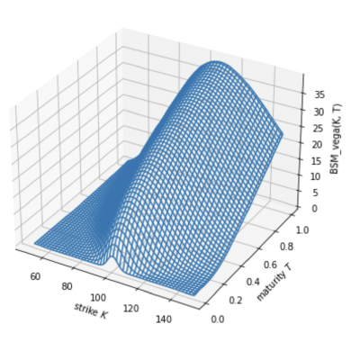

 

# Derivatives Analytics with Python 🐍

## Mission 🚀
The goal of this repo is to provide ready-to-use code and references for analyzing, valuing and pricing derivatives. This is an ensemble of codes, theory and additional resources on the nitty gritty of derivatives and options pricing.

## Structure 🏛
1. **The Market**: Includes codes on topics related to market based valuation such as risks affecting the value of equity index options. Covers the stylized facts of markets.
2. **Theoretical Valuation**: Covers codes on the following:
  * Arbitrage pricing theory, risk neutral valuation in discrete time and continuous time according to the Harrison-Kreps-Pliska paradigm.
  * The complete market models of Black-Scholes-Merton (BSM) and Cox-Ross-Rubinstein (CRR) - benchmarks for option valuation.
  * Fourier-based approaches to derive semi-analytical valuation formulas for European options in market models that are more complex and realistic than BSM or CRR models. This includes:
    - Method of Carr-Madan (Carr and Madan, 1999)
    - Method of Lewis (Lewis, 2001)
  * Valuation of American options using binomial trees and Monte Carlo simulations with specific focus on the Least-Squares Monte Carlo algorithm of Longstaff-Schwartz (Longstaff, Schwartz, 2001).
3. **Market Based Valuation**:
  * Merton's Jump Diffusion model (Merton, 1976).
  * Bakshi-Cao-Chen (cf. Bakshi et al. (1997)) which accounts for stochastic volatility, jumps and stochastic short rates.
  * Discretization and simulation of the stochastic volatility model by Heston (Heston, 1993) with constant as well as stochastic short rates according to Cox-Ingersoll-Ross (Cox et al., 1985).
  * Numerical calibration of the general market model to real market data.
  * Value European and American index options via Monte Carlo simulation in the calibrated general market model.
  * Dynamic delta hedging strategies for American options by Monte Carlo simulation in different settings, from a simple one to the calibrated market model.

## Articles and References 📖
* ... work in progress!
